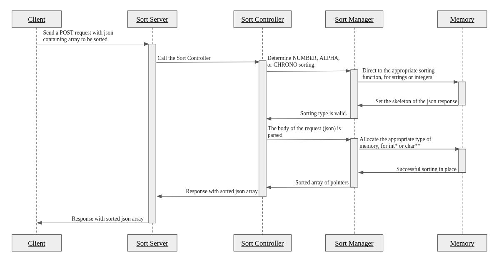

# sort server
A sorting server for ascending alphabetical, numerical, and chronological sorts.
<!-- TOC -->
* [sort server](#sort-server)
  * [Usage](#usage)
    * [Welcome to the sort_server](#welcome-to-the-sort_server)
    * [Building](#building)
    * [Including sort_server](#including-sort_server)
    * [Data Structure](#data-structure)
    * [External Libraries Used: cJSON](#external-libraries-used-cjson)
    * [Example](#example)
      * [Send a request to sort numerically](#send-a-request-to-sort-numerically)
      * [Send a request to sort alphabetically](#send-a-request-to-sort-alphabetically)
      * [Send a request to sort chronologically](#send-a-request-to-sort-chronologically)
    * [Caveats](#caveats)
      * [Case Sensitivity](#case-sensitivity)
      * [C Standard](#c-standard)
      * [Character Encoding](#character-encoding)
    * [Enjoy sort_server](#enjoy-sort_server)
  * [Usage](#usage-1)
    * [Welcome to the sort_server](#welcome-to-the-sort_server-1)
    * [Enjoy sort_server](#enjoy-sort_server-1)
<!-- TOC -->
## Usage
### Welcome to the sort_server
sort_server's purpose is to quickly sort numbers and strings.
The sort server itself is one C file. There are two more C files: one to create a server struct and another, an external library, for jSON parsing.
#### Unified Modeling Language (UML) Diagrams



### Building
The easiest way to build this library is to copy the files to your project and start using them. 
Just copy `sort_server.c` and `sort_server.h`. Note that the program has a dedicated `main.c` file. 
You would also have to copy the `server.c` and `server.h` to instantiate a server and a request. 
The file set of files is for parsin JSON, for which I used an external library cJSON and the files are `cJSON.h` and `cJSON.c`. 

### External Libraries Used: cJSON
For parsing, I used an MIT-licensed library, cJSON. To learn more about cJSON, you can visit its GitHub [page](https://github.com/DaveGamble/cJSON/tree/master "optional-title").
Note that cJSON is written in ANSI C (C89)to maximize scope, while sort_server is written in C11 (C standard version).
### Examples
Below are a few examples of use cases. In each case, the microservice must first be built and compiled. 
Then you can start the service by specifying the port you want to listen on (in this case 5527):
``` c
int main(int argc, char* argv[]) {
    Server server = create_server(5527);
    ...
```
Before sending any POST requests, make sure you have connected to the server:
```python
def main():
    resultGet = requests.get("http://localhost:5527")
    if resultGet.status_code == 200:
        print("Connected to sorting server.")
```
Also make sure that you have a way of quitting the server when you're done:
```python
    while(True):
      command = input("To send a file to be sorted, type <send>. To quit, type <quit>: ")
      if command == "quit":
        break
```
#### Send a request to sort numerically
Say we have a file names <restaurant_id.json> in the following json format:
```json
{
    "type": "NUMBER",
    "resolutions": [45, -23, 90, 67, 45]
}
```

you can make a POST request and add the json to the body of the request. In python, the request may look like this:
```python
//create a request to sort numbers (integers) by giving the path of the json file
    path = input("Enter json file absolute path: ")
    try:
      with open(path, "rb") as f:
        bytes = f.read()
      result = requests.post("http://localhost:5527", bytes)
      if result.status_code == 200:
        print(result.content)
        continue
    
    except FileNotFoundError:
      print("Path not recognized.\n")
```
Here the client example prints the results to standard out, and you can redirect the results to be saved to a specific json file. 
#### Send a request to sort alphabetically
Say we have a file names <restaurant_name.json> in the following json format:
```json
{
    "type": "ALPHA",
    "resolutions": ["Silver Palate", "Pizza Pizza", "Spaghetti Western", "Bomb Bread", "Gelato Gater"]
}
```
The POST request looks identical to the one above; note the only difference is that we specified "ALPHA" as the sort "type".
#### Send a request to sort chronologically
Finally, we can do a chronological sort. The important thing here is to remember that the date format must be "yyyy-mm-dd", and the json may look like:
```json
{
    "type": "CHRONO",
    "resolutions": ["1996-02-03", "2024-12-01", "2025-02-24", "1981-10-01", "1982-01-02"]
}
```
### Caveats
#### Case Sensitivity
cJSON method used in the sort server used the Case Sensitive parsing methods. This means that "alpha" will be sorted after "Alpha".
#### C Standard
The C standard used in sort_server is  C11 (C standard version).
#### Character Encoding
The sort-server uses UTF-8 encoding. Note that if you write the client in python3, strings are by default Unicode and encoded UTF-8. 
### Enjoy sort_server
- Lora Dushanova (original author)